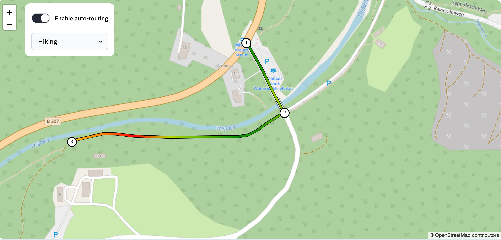

## What is a trail?

In wanderer a trail is an object that contains both GPS data and various kinds of metadata (like a description, photos, waypoints etc.) that make it easily searchable. 

## Create a trail
To create a new trail click the <button class="h-10 text-white rounded-lg px-4 py-2 mx-2 bg-primary font-semibold transition-all hover:bg-primary-hover focus:ring-4 ring-zinc-400 leading-none">+ New Trail</button> button in the top right corner.

### Provide a route
A route is the GPS data of a trail. There are two main ways that a user can provide a route.

#### Upload a file

Click the `Upload file` button and choose a file. The file must be either in GPX, FIT, TCX, or KML format. Once you have selected a file you will see a couple of things happen: 
- the map will display and focus on your track. 
- the elevation profile and speed charts (if your file contains that information) will be updated accordingly. 
- in the left-hand panel information like the trail name, location, and distance will be displayed.

#### Draw a route

Instead of clicking the `Upload file` button, you can also click the `Draw a route` button. This will activate the drawing mode. Notice that your cursor is now a cross when hovering over the map. Clicking on the map in drawing mode will create a new waypoint. You can drag and drop it anywhere on the map to update its position. To delete it, click first on the waypoint and then on the red trashcan icon. Creating a second waypoint will create a route between it and the previous one. 

By default, wanderer uses the [valhalla routing engine](https://github.com/valhalla/valhalla) to calculate the route between the two points. Via the menu in the top-left corner of the map, you can choose your preferred mode of transport which will influence the route calculation. If you disable auto-routing wanderer will not use `valhalla`, but instead, simply draw a straight line between the two points. 

When you are done with drawing click the `Stop drawing` button to deactivate the drawing mode.

:::tip
wanderer uses a public, free `valhalla` server by default. The server is financed by donations. Please consider donating at [https://www.fossgis.de/verein/spenden/](https://www.fossgis.de/verein/spenden/). 
:::

### Basic Info

Most of the data in this section should be self-explanatory. The only required field is the name: every trail needs a name. If you created your route by uploading a file, wanderer tries to infer most of the information directly from the file. However, you are of course free to edit this information afterwards.
Toggling the public switch to on will make the trail visible for everyone even visitors who are not logged in.

### Waypoints

Waypoints mark points of interest along the route. A trail can have as many waypoints as you like. Click the `+ Add Waypoint` button to start. By default, a waypoint will be positioned in the center of the map. You can change the position either directly by entering a new latitude and longitude or simply moving the waypoint around on the map after saving it first. 

Additionally, a waypoint has an icon that is displayed in the map marker. wanderer uses fontawsome icons, so any icon from this [list](https://fontawesome.com/search?q=share&o=r&m=free) is available. If you wish, you can also add photos to the waypoint to make it event more recognizable.

### Photos

You can also add photos to the trail itself. If you add more than one photo you can choose which one should be used as the thumbnail. It will be featured in the trail overview.

### Summit book

If you do the same trail multiple times but do not want to create a new trail every time, you can simply make a new entry in the summit book to log the completion of the trail.

## Save the trail

Once you are done creating your trail simply click the <button class="h-10 text-white rounded-lg px-4 py-2 mx-2 bg-primary font-semibold transition-all hover:bg-primary-hover focus:ring-4 ring-zinc-400 leading-none">Save Trail</button> button. This will save your trail to the database and create a new index entry to make ensure that you will find your trail in the future.
